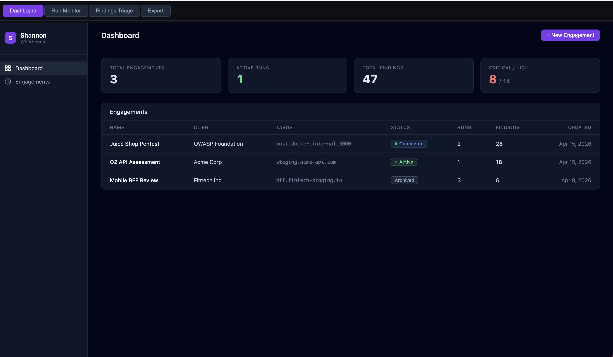
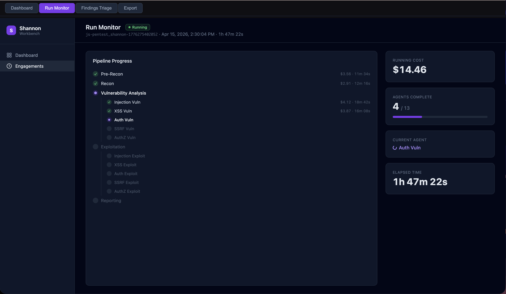
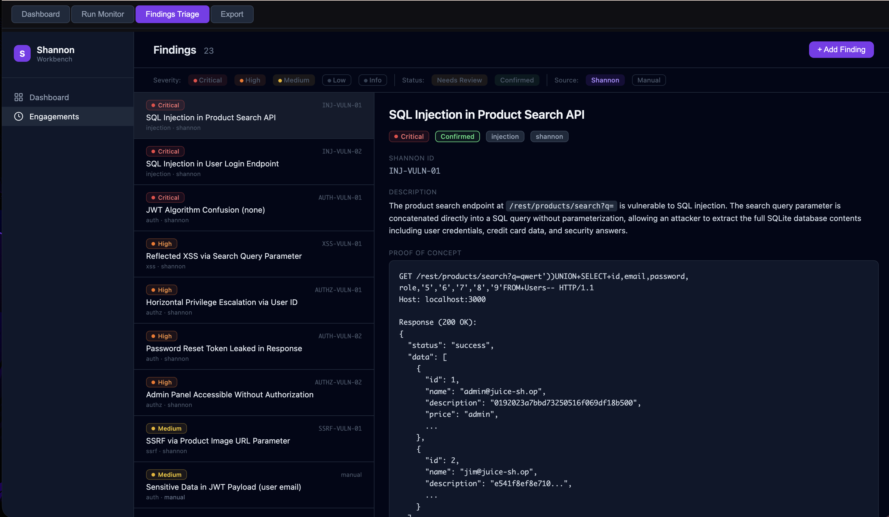
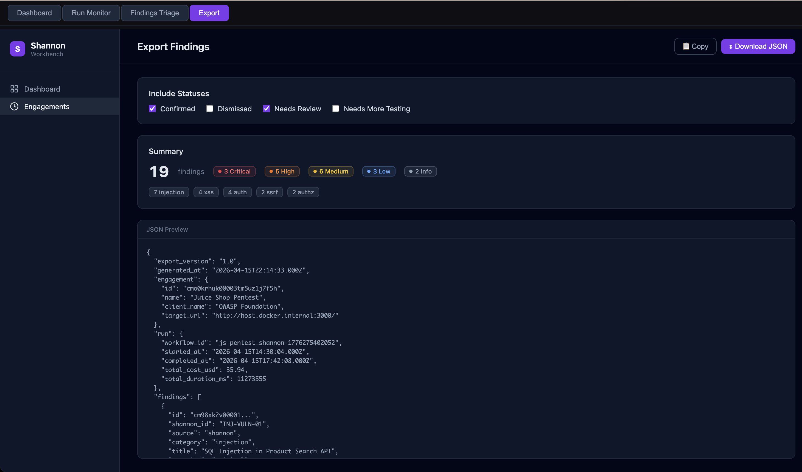

# Shannon Workbench

An engagement management UI for [Shannon](https://github.com/KeygraphHQ/shannon), Keygraph's autonomous AI pentester. Shannon Workbench gives AppSec testers a structured workflow around Shannon's automated scanning: configure, launch, monitor, triage, and export — all from a single dashboard.

## What is Shannon?

[Shannon](https://github.com/KeygraphHQ/shannon) is an autonomous, white-box AI pentester built by [Keygraph](https://keygraph.io). It combines source code analysis with live exploitation using a **13-agent pipeline** orchestrated by Temporal, running inside Docker. Each scan progresses through five phases:

**Phase 1 — Pre-Reconnaissance** (`pre-recon`): External scanning with nmap, subfinder, and whatweb to fingerprint the target's infrastructure. Simultaneously analyzes the source code to identify frameworks, entry points, and potential attack surface.

**Phase 2 — Reconnaissance** (`recon`): Builds a comprehensive attack surface map by correlating code-level insights with live browser exploration of the running application. Produces a detailed inventory of API endpoints, authentication mechanisms, and input vectors.

**Phase 3 — Vulnerability Analysis** (5 parallel agents): Specialized agents hunt for vulnerabilities concurrently, each focused on one OWASP category:
- `injection-vuln` — SQL injection, command injection, template injection via data flow analysis from user input to dangerous sinks
- `xss-vuln` — Reflected and DOM-based cross-site scripting
- `auth-vuln` — Broken authentication: weak JWT implementations, credential stuffing, session fixation
- `ssrf-vuln` — Server-side request forgery via URL parameters, file uploads, webhooks
- `authz-vuln` — Broken access control: horizontal/vertical privilege escalation, IDOR, missing function-level checks

Each agent produces a list of **hypothesized exploitable paths** — not confirmed vulnerabilities yet.

**Phase 4 — Exploitation** (5 parallel agents): Dedicated exploit agents receive the hypotheses and attempt real-world attacks using browser automation and CLI tools:
- `injection-exploit`, `xss-exploit`, `auth-exploit`, `ssrf-exploit`, `authz-exploit`

Shannon enforces a strict **"No Exploit, No Report"** policy — if a hypothesis can't be proven with a working PoC, it's discarded as a false positive.

**Phase 5 — Reporting** (`report`): Consolidates all validated findings into a structured report with reproducible, copy-paste proof-of-concept exploits.

The Workbench monitors all 13 agents in real time through Shannon's Temporal `getProgress` query, showing per-agent cost, duration, and status as each phase completes.

## Why This Exists

Shannon finds vulnerabilities fast. But a pentest isn't just a scan — it's an engagement with scope, context, client expectations, and findings that need human judgment before they go into a report. Shannon Workbench bridges that gap.

**This is a companion tool for security testers, not a replacement.** Shannon handles the heavy lifting (recon, vuln analysis, exploitation), and the Workbench gives you the controls:

- **Before the scan:** Configure auth, scope rules, and pipeline settings through a guided wizard instead of hand-editing YAML
- **During the scan:** Monitor agent progress, costs, and elapsed time in real time — stop and resume from checkpoints
- **After the scan:** Triage findings with severity/status workflows, add your own manual findings alongside Shannon's, then export a clean JSON deliverable

## Screenshots

**Dashboard** — engagement overview with run counts and finding totals


**Run Monitor** — live SSE-driven view of Shannon's 13-agent pipeline


**Findings Triage** — two-panel UI with filters, inline editing, and auto-save


**Export** — filter by status, preview JSON, download


## Features

- **Engagement lifecycle** — Create, edit, and track pentest engagements with client info, target URLs, threat models, and notes
- **5-step config wizard** — Context review, auth builder (form/SSO/API/basic + TOTP + login flow steps), scope rules (focus/avoid with duplicate and conflict detection), pipeline settings, and YAML preview before launch
- **Live run monitor** — SSE-driven dashboard showing Shannon's 13-agent pipeline: phase timeline, per-agent cost and duration, progress bar, elapsed timer
- **Stop and resume** — Stop a running scan and resume later from Shannon's workspace checkpoint — completed agents are skipped automatically
- **Findings triage** — Two-panel UI with severity/status/source filters. Inline editing with auto-save. Supports both Shannon-discovered and manually-added findings side by side
- **Export** — Filter by status, preview the JSON, download or copy to clipboard

## Architecture

| Layer | Tech |
|-------|------|
| Framework | Next.js 16, App Router, TypeScript |
| Database | SQLite via Prisma 7 + `@prisma/adapter-better-sqlite3` |
| UI | shadcn/ui + Tailwind CSS, dark theme |
| Shannon integration | `npx @keygraph/shannon` via `child_process` |
| Run monitoring | `@temporalio/client` polling Shannon's `getProgress` query |
| Real-time updates | Server-Sent Events (SSE) |

## Getting Started

### Prerequisites

- **Node.js 18+**
- **Docker** — Shannon runs its worker and Temporal server in containers
- **Shannon CLI** — available via `npx @keygraph/shannon` (no global install needed)
- **AI provider credentials** — Anthropic API key or Claude Code OAuth token, configured via `npx @keygraph/shannon setup`

### Setup

```bash
# Clone the repo
git clone https://github.com/jrsherlock/shannon-workbench.git
cd shannon-workbench

# Install dependencies
npm install

# Set up the database
npx prisma generate
npx prisma migrate deploy

# Set up Shannon (one-time — starts Temporal container, configures credentials)
npx @keygraph/shannon setup

# Start the dev server
npm run dev
```

The workbench runs at `http://localhost:3000` (or the next available port).

### Environment Variables

Create a `.env` file:

```bash
DATABASE_URL="file:./prisma/dev.db"
TEMPORAL_ADDRESS="localhost:7233"
# Optional: override if you have a global Shannon install
# SHANNON_CLI_PATH="shannon"
```

### Running a Scan

1. **Create an engagement** — name, client, target URL, repo path, and context
2. **Configure a run** — walk through the 5-step wizard (auth, scope, pipeline)
3. **Launch** — Shannon starts scanning autonomously
4. **Monitor** — watch agents complete in real time on the run monitor
5. **Triage** — import findings, review/edit/dismiss, add manual findings
6. **Export** — filter by status and download the JSON report

> **Important:** If your target app runs on `localhost`, use `http://host.docker.internal:<port>/` as the target URL — Shannon's worker runs inside Docker and needs to reach your host network.

## Project Structure

```
app/
  api/                    # 11 API routes (engagements, runs, findings, export)
  engagements/            # Engagement pages (CRUD, config wizard, monitor, triage, export)
  page.tsx                # Dashboard
components/ui/            # shadcn/ui components
lib/
  config-builder.ts       # Wizard state -> Shannon YAML
  shannon-launcher.ts     # npx @keygraph/shannon CLI wrapper
  temporal-client.ts      # Temporal progress queries
  finding-ingester.ts     # Shannon deliverables -> DB records
  db.ts                   # Prisma client singleton
prisma/
  schema.prisma           # Engagement, Run, Finding, ConfigTemplate models
```

## Roadmap

- **Black-box mode support** — Shannon also supports black-box scanning (no source code required), using only a target URL. The Workbench currently requires a repo path for white-box scans. A future release will let testers choose between white-box and black-box modes in the config wizard, making the tool useful for external assessments where source access isn't available.
- **Finding diff across runs** — Compare findings between runs to track what's new, fixed, or regressed
- **Report generation** — Export to PDF/Markdown pentest report templates, not just raw JSON
- **CI/CD integration** — Trigger scans from GitHub Actions or other pipelines and post results back as PR comments

## License

MIT
